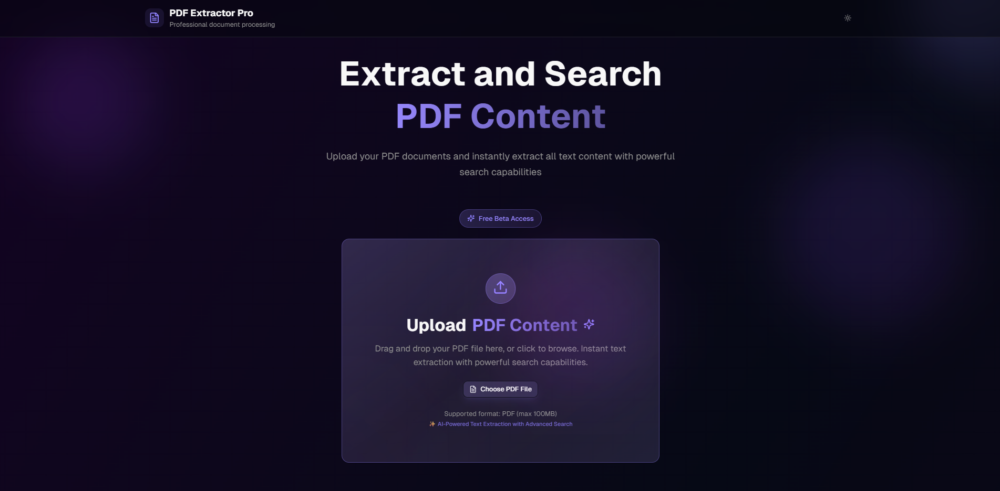

# PDF Extractor Pro



<div align="center">

[](https://pdf-extractor-pro-app.vercel.app)
[](https://nextjs.org/)
[](https://react.dev/)
[](https://www.typescriptlang.org/)
[](https://tailwindcss.com/)

An advanced, privacy-first web application for instantly extracting, searching, and managing text from PDF documents. Built with modern web technologies for a lightning-fast component-based architecture.

[View Demo](https://pdf-extractor-pro-app.vercel.app) · [Report Bug](https://github.com/yourusername/pdf-extractor-app/issues) · [Request Feature](https://github.com/yourusername/pdf-extractor-app/issues)

</div>

---

## 🚀 Features

PDF Extractor Pro is designed with performance and privacy at its core.

- **🔒 100% Private**: All PDF processing happens locally in your browser immediately. Your documents **never** leave your device or touch a server.
- **⚡ Lightning Fast**: Powered by `unpdf` and WebAssembly, text extraction is instantaneous.
- **🔍 Powerful Search**: Real-time regex-supported search with hit highlighting and instant navigation between matches.
- **📄 Smart Layout**: Preserves document structure with intelligent paragraph detection and page break recognition.
- **🎨 Modern UI**: A stunning, responsive interface built with Shadcn/UI, Framer Motion, and Tailwind CSS v4.
- **📤 Easy Export**: One-click options to copy text or download extracted content.

## 🛠️ Tech Stack

This project uses the latest and greatest tools in the React ecosystem:

- **Framework**: [Next.js 15 (App Router)](https://nextjs.org/)
- **Language**: [TypeScript](https://www.typescriptlang.org/)
- **Styling**: [Tailwind CSS v4](https://tailwindcss.com/) & [PostCSS](https://postcss.org/)
- **UI Components**: [Shadcn/UI](https://ui.shadcn.com/) (Radix UI based)
- **Animations**: [Framer Motion](https://www.framer.com/motion/) & [TailwindCSS Animate](https://github.com/jamiebuilds/tailwindcss-animate)
- **PDF Processing**: [Unpdf](https://unpdf.vercel.app/)
- **Icons**: [Lucide React](https://lucide.dev/)
- **Charts**: [Recharts](https://recharts.org/)
- **Forms**: [React Hook Form](https://react-hook-form.com/) + [Zod](https://zod.dev/)
- **Deployment**: [Vercel](https://vercel.com/)

## 🏁 Getting Started

To run this project locally, follow these steps:

### Prerequisites

- Node.js 18+ installed
- npm, yarn, or pnpm

### Installation

1. **Clone the repository**

   ```bash
   git clone https://github.com/yourusername/pdf-extractor-app.git
   cd pdf-extractor-app
   ```

2. **Install dependencies**

   ```bash
   npm install
   # or
   yarn install
   # or
   pnpm install
   ```

3. **Start the development server**

   ```bash
   npm run dev
   ```

4. **Open your browser**
   Navigate to [http://localhost:3000](http://localhost:3000) to see the application running.

## 📁 Project Structure

```bash
pdf-extractor-app/
├── app/                  # Next.js App Router
│   ├── api/              # API routes
│   ├── globals.css       # Global styles
│   ├── layout.tsx        # Root layout
│   └── page.tsx          # Home page
├── components/           # React components
│   ├── ui/               # Shadcn UI components
│   ├── extracted-content.tsx
│   ├── landing-content.tsx
│   └── ...
├── hooks/                # Custom hooks (Theme, Toast)
├── lib/                  # Utility functions
├── public/               # Static assets
└── styles/               # Additional styles
```

## 🤝 Contributing

Contributions are what make the open-source community such an amazing place to learn, inspire, and create. Any contributions you make are **greatly appreciated**.

1. Fork the Project
2. Create your Feature Branch (`git checkout -b feature/AmazingFeature`)
3. Commit your Changes (`git commit -m 'Add some AmazingFeature'`)
4. Push to the Branch (`git push origin feature/AmazingFeature`)
5. Open a Pull Request

## 📄 License

Distributed under the MIT License. See `LICENSE` for more information.

## 🙏 Acknowledgments

- [Next.js Team](https://nextjs.org/)
- [Vercel](https://vercel.com/)
- [Radix UI](https://www.radix-ui.com/)
- [Shadcn](https://twitter.com/shadcn)

---

<div align="center">
  <p>Built with ❤️ by <a href="https://github.com/yourusername">Your Name</a></p>
</div>
